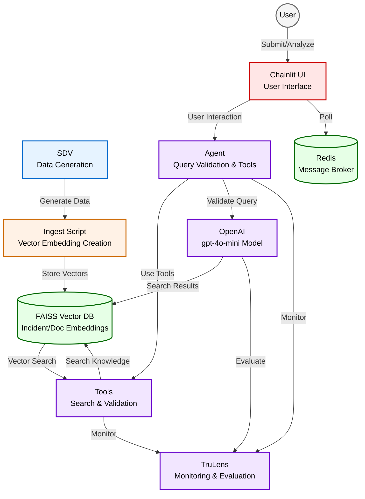

# CortexOps
⚠️ This is a proof of concept and is not production-ready. Use at your own risk.

This project is authored by Arjay Nacion and may be freely used or modified by Myridius, provided attribution is retained.

## Description
Smart incident resolution powered by AI, using synthetic data for demonstration purposes. The system provides IT support teams with rapid, contextually relevant resolution recommendations for new incident reports by leveraging AI-generated knowledge from past incidents and documentation.

## How it Works
1. **Synthetic Data Generation**: Using SDV (Synthetic Data Vault) to generate realistic synthetic incidents and documentation:
   - ServiceNow incidents with descriptions, categories, and resolutions
   - ServiceNow Knowledge Base articles with troubleshooting guides and best practices
   - Data represents common and edge-case scenarios in Merchant Onboarding

2. **Knowledge Base**: Vector embeddings stored in FAISS database for semantic search

3. **Incident Processing**: HTTP POST endpoint receives new incidents for analysis

4. **AI-Powered Analysis**: Agent-based system with OpenAI (gpt-4o-mini) for inference and feedback:
   - Validates query relevance to Merchant Onboarding System
   - Uses tools to search incidents and knowledge base
   - Generates resolution recommendations with conversation memory
   - Real-time streaming via Chainlit UI

## Tools
- OpenAI (gpt-4o-mini) - LLM for inference and feedback
- SDV - Synthetic data generation
- LangChain - LLM application framework
- Chainlit - Chatbot UI framework
- FAISS - Vector similarity search
- FastAPI - API framework
- Redis - Message broker
- TruLens - LLM application monitoring and evaluation

## Architecture



## Monitoring and Evaluation
The system uses TruLens for comprehensive monitoring and evaluation of the RAG pipeline:
- **Feedback Collection**: Tracks user feedback on resolution recommendations
- **Performance Metrics**: Monitors latency, token usage, and response quality
- **Quality Assurance**: Evaluates retrieval relevance and generation accuracy
- **Custom Feedback Functions**: Implements domain-specific evaluation criteria for incident resolution quality

## Current Limitations
- Proof of concept using synthetic data
- Polling-based Redis implementation
- OpenAI API dependency
- Basic agent implementation with query validation

## Future Enhancements
- Redis Pub/Sub integration
- Production-grade security
- Cloud-based deployment
- Enhanced agentic capabilities

## Set Up
- Install Anaconda - https://www.anaconda.com/download
- Setup a new Conda environment with Python 3.10
```
conda create -n <your environment name> python=3.10
```
- Activate your environment
```
conda activate <your environment name>
```
- Install the dependencies
```
pip install -r requirements.txt
```
- Setup .env file
Create a `.env` file at the root folder and add the following contents:
```properties
# Datasets
INCIDENTS_DATASET_HF_REPO_ID=6StringNinja/synthetic-servicenow-incidents
INCIDENTS_SEED_DATASET_HF_REPO_ID=6StringNinja/synthetic-incidents-seed

KNOWLEDGE_BASE_SEED_DATASET_HF_REPO_ID=6StringNinja/synthetic-kb-seed
KNOWLEDGE_BASE_DATASET_HF_REPO_ID=6StringNinja/synthetic-kb

CONFLUENCE_DATASET_HF_REPO_ID=6StringNinja/synthetic-documentations

# FAISS Index
INDEX_PATH=data/index

# V2 Params
INCIDENTS_INDEX_PATH=data/index/incidents
KNOWLEDGE_BASE_INDEX_PATH=data/index/kb

# Hugging Face
HF_TOKEN=Your HuggingFace API Token>

# OpenAI
OPENAI_API_KEY=<Your OpenAI API KEY>
```

### Run the API Server
```
./run_api.sh
```

### Run the Chainlit UI
```
./run_ui.sh
```

**Note:** Both API and UI requires a Redis server running. You can either install it directly or use a Docker container.

### Submitting New Incident Requests
Checkout `new_incident.http` file. You can either use the payloads with Postman or install the `REST Client` plugin to Cursor or VS Code and you should be able to execute those payloads within Cursor/VS Code.