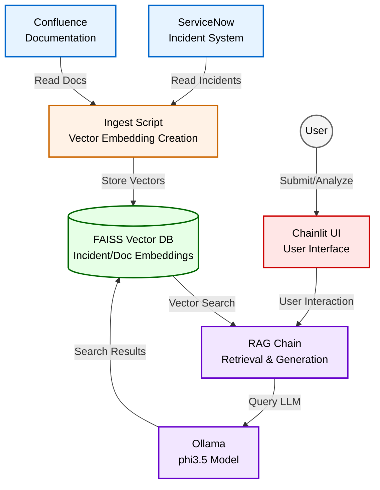

# CortexOps
⚠️ This is a proof of concept and is not production-ready. Use at your own risk.

This project is authored by Arjay Nacion and may be freely used or modified by Myridius, provided attribution is retained.

## Description
Smart incident resolution powered by AI, using synthetic data for demonstration purposes.

Designed to demonstrate how AI can accelerate and enhance the process of resolving IT incidents. The system uses synthetically generated incident data and documentation to simulate a real-world environment. By leveraging AI-generated knowledge from past incidents and documentation, combined with advanced AI reasoning, the system provides IT support teams with rapid, contextually relevant resolution recommendations upon receiving new incident reports.

## How it Works:
The system operates through a combination of synthetic data generation and real-time incident processing:

1. **Synthetic Data Generation**: The system uses AI to generate realistic synthetic incidents and documentation that mimic real-world IT support scenarios. This includes:
   - Synthetic ServiceNow incidents with realistic descriptions, categories, and resolutions
   - Synthetic Confluence documentation with troubleshooting steps and best practices
   - All data is generated to represent common and edge-case scenarios in a Merchant Onboarding system

2. **Knowledge Base Creation**: The synthetic data is processed into vector embeddings stored in a FAISS database, creating a searchable knowledge base that simulates a real-world knowledge repository.

3. **Incident Processing**: New synthetic incidents can be submitted via HTTP POST requests to the system. The Chainlit interface receives these incidents and provides an option to analyze them.

4. **AI-Powered Analysis (RAG Chain)**: When analysis is requested, the RAG Chain queries the FAISS vector database to retrieve similar synthetic incidents and relevant documentation. This context is provided to a Large Language Model (LLM), hosted by Ollama (using phi3.5), along with the new incident details. The LLM generates a recommended resolution.

5. **Resolution Delivery**: The generated resolution is displayed to the user within the Chainlit UI, with real-time streaming of the response.

## Tools
1. Ollama - for running LLMs locally
2. Anaconda - Data Science and AI Distribution Platform
3. LangChain - framework for developing applications powered by large language models (LLMs).
4. Chainlit - an open-source Python library designed to streamline the creation of chatbot applications ready for production.
5. FAISS - stands for Facebook AI Similarity Search, is a library developed by Facebook AI Research. It provides efficient tools for performing similarity search and clustering on large datasets of dense vectors.
6. FastAPI - a modern, high-performance web framework for building APIs with Python.
7. Redis - an open-source, in-memory data structure server, meaning it's primarily used as a database, cache, or message broker. 

## Data Generation
The system uses two main scripts for synthetic data generation:

1. **synthesize_tickets.py**: Generates realistic synthetic IT support tickets that mimic real ServiceNow incidents. These tickets include:
   - Various incident types (common and edge cases)
   - Realistic descriptions and resolutions
   - Different urgency and impact levels
   - Different categories and assignment groups

2. **synthesize_docs.py**: Creates synthetic Confluence-style documentation that includes:
   - Troubleshooting guides
   - Best practices
   - Investigation steps
   - Tool recommendations

All synthetic data is designed to represent realistic scenarios in a Merchant Onboarding system, including:
- Sales Agent portal issues
- Merchant portal problems
- Payment processing errors
- Equipment installation issues
- Document generation problems
- Validation and compliance errors

## Architecture

**Explanation of Components and Flow:**

1. **ServiceNow & Confluence:** External source systems containing the raw data (incidents and documentation).
2. **Ingest Script:** Processes data from ServiceNow and Confluence, creates vector embeddings, and stores them in the FAISS database.
3. **FAISS Vector DB:** Stores vector embeddings of incidents and documentation for similarity search.
4. **Chainlit UI:** The user interface that:
   - Receives new incidents via HTTP POST
   - Presents an "Analyze" action to users
   - Displays the AI-generated resolution with real-time streaming
5. **RAG Chain:** Core logic that:
   - Takes incident details as input
   - Queries the FAISS Vector DB for similar incidents and documentation
   - Combines retrieved information with the incident details
   - Sends the prompt to Ollama
6. **Ollama (phi3.5):** Hosts the language model that generates resolution recommendations.
7. **User:** Interacts with the Chainlit UI to submit and analyze incidents.

## Current Limitations
- The system is currently a proof of concept
- Uses synthetic data for demonstration purposes
- Webhook integration with ServiceNow is not implemented
- Redis Pub/Sub for real-time notifications is not implemented
- The system uses a simple HTTP endpoint for incident submission

## Future Enhancements
- Integration with real ServiceNow and Confluence systems
- Implementation of real-time webhook notifications
- Addition of real-world incident data
- Enhanced validation and error handling
- Production-grade security measures