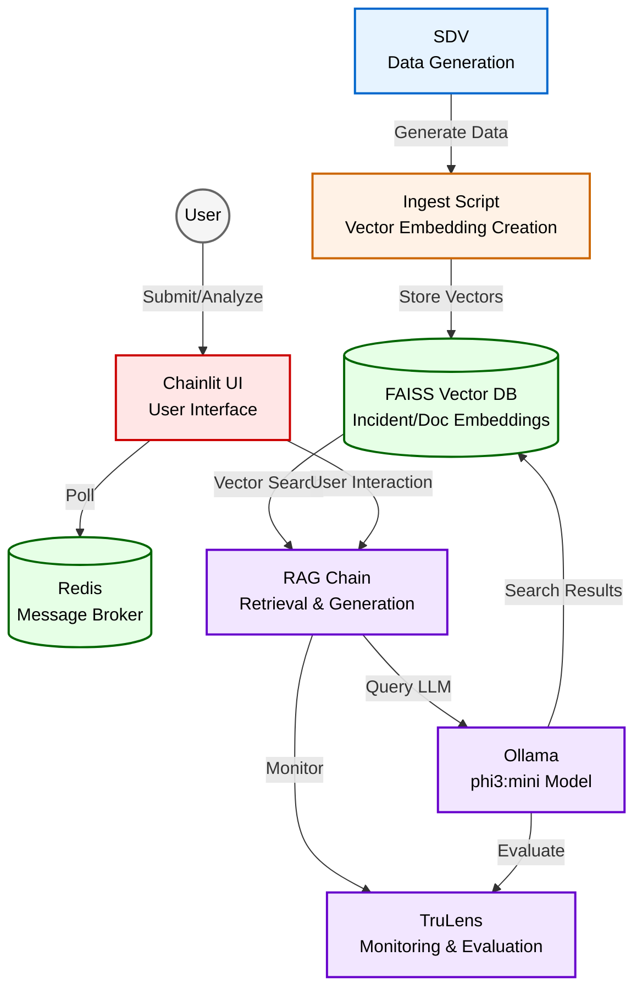

# CortexOps
⚠️ This is a proof of concept and is not production-ready. Use at your own risk.

This project is authored by Arjay Nacion and may be freely used or modified by Myridius, provided attribution is retained.

## Description
Smart incident resolution powered by AI, using synthetic data for demonstration purposes. The system provides IT support teams with rapid, contextually relevant resolution recommendations for new incident reports by leveraging AI-generated knowledge from past incidents and documentation.

## How it Works
1. **Synthetic Data Generation**: Using SDV (Synthetic Data Vault) to generate realistic synthetic incidents and documentation:
   - ServiceNow incidents with descriptions, categories, and resolutions
   - ServiceNow Knowledge Base articles with troubleshooting guides and best practices
   - Data represents common and edge-case scenarios in Merchant Onboarding

2. **Knowledge Base**: Vector embeddings stored in FAISS database for semantic search

3. **Incident Processing**: HTTP POST endpoint receives new incidents for analysis

4. **AI-Powered Analysis**: RAG Chain with Ollama (phi3:mini) for inference and feedback:
   - Retrieves similar incidents and documentation from FAISS
   - Generates resolution recommendations
   - Real-time streaming via Chainlit UI

## Tools
- Ollama (phi3:mini) - Local LLM for inference and feedback
- SDV - Synthetic data generation
- LangChain - LLM application framework
- Chainlit - Chatbot UI framework
- FAISS - Vector similarity search
- FastAPI - API framework
- Redis - Message broker
- TruLens - LLM application monitoring and evaluation

## Architecture

## Monitoring and Evaluation
The system uses TruLens for comprehensive monitoring and evaluation of the RAG pipeline:
- **Feedback Collection**: Tracks user feedback on resolution recommendations
- **Performance Metrics**: Monitors latency, token usage, and response quality
- **Quality Assurance**: Evaluates retrieval relevance and generation accuracy
- **Custom Feedback Functions**: Implements domain-specific evaluation criteria for incident resolution quality

## Current Limitations
- Proof of concept using synthetic data
- Polling-based Redis implementation
- Basic RAG chain without agentic capabilities
- Local LLM deployment

## Future Enhancements
- Agentic RAG implementation
- Redis Pub/Sub integration
- Production-grade security
- Cloud-based LLM deployment